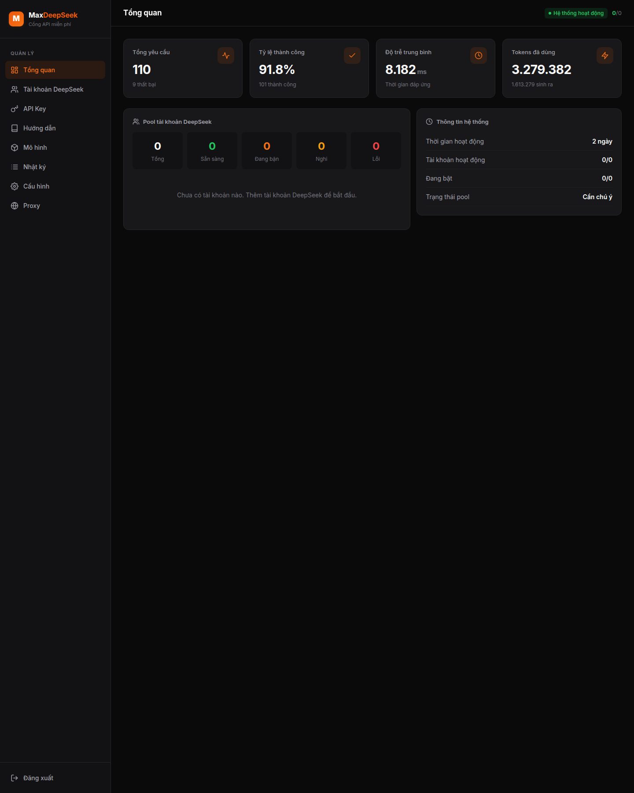
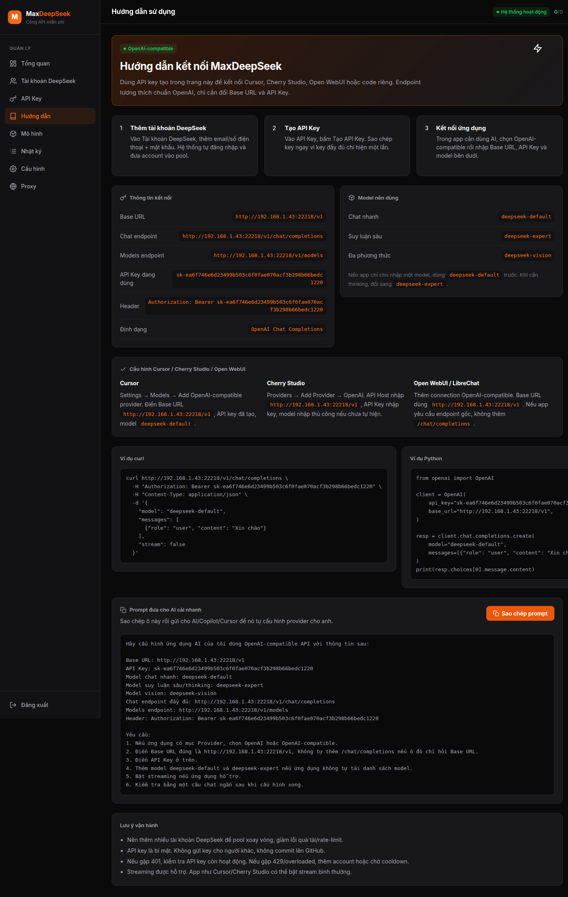
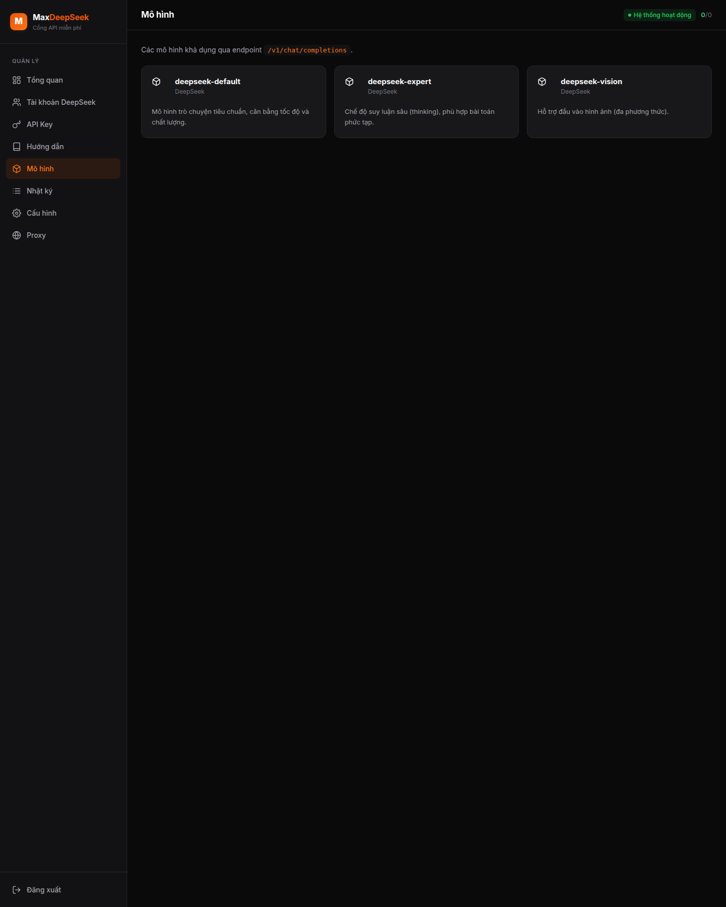

# Max-DeepSeek

Max-DeepSeek là cổng API self-hosted tương thích OpenAI, dùng pool tài khoản DeepSeek web để xoay vòng, failover và quản trị bằng dashboard tiếng Việt.

> Mục đích chính: tự host cho cá nhân hoặc nhóm nhỏ. Trước khi public instance cho người khác dùng, hãy tự kiểm tra điều khoản dịch vụ của DeepSeek và chính sách của bên proxy/upstream mà bạn đang sử dụng.

## Dự án này phù hợp khi nào?

- Bạn muốn expose một API giống OpenAI cho tools, no-code hoặc app nội bộ
- Bạn cần dashboard đơn giản để quản lý tài khoản, API key và logs
- Bạn ưu tiên tự host nhanh bằng Docker Compose
- Bạn chấp nhận đây là một self-hosted gateway do cộng đồng vận hành, không phải dịch vụ managed

## Tính năng



_Giao diện tổng quan của dashboard admin sau khi đăng nhập._



_Trang Hướng dẫn để nối Max-DeepSeek vào Cursor, Cherry Studio và ứng dụng OpenAI-compatible._



_Trang Mô hình cho thấy các model được expose qua gateway._

- Tương thích OpenAI: `/v1/models`, `/v1/chat/completions`, hỗ trợ stream và non-stream
- Pool tài khoản DeepSeek: login nền, xoay vòng theo tải, cooldown và recovery khi account bị giới hạn
- Hiển thị thống kê request, token, độ trễ, log và tình trạng account
- Quản lý API key, proxy/API base và usage proxy theo ngày
- Dashboard React/Vite tiếng Việt, phù hợp vận hành self-hosted
- Triển khai nhanh bằng Docker Compose

## Kiến trúc nhanh

- `backend/`: FastAPI gateway, account pool, PoW solver, OpenAI-compatible API
- `web/`: React + Vite + TypeScript cho admin dashboard
- `docker/`: Dockerfile, Compose và dữ liệu runtime local
- `scripts/`: smoke test và tiện ích validate nhanh

## Yêu cầu

- Docker + Docker Compose
- Tài khoản DeepSeek tại `https://chat.deepseek.com`
- Nếu server đặt ở khu vực dễ bị WAF/rate limit, nên có proxy non-US hoặc API base trung gian

## Cài đặt nhanh

Repo public: `https://github.com/manhvicky/Max-DeepSeek`

Tài liệu liên quan:

- Hướng dẫn đóng góp: `CONTRIBUTING.md`
- Chính sách bảo mật: `SECURITY.md`
- Ghi chú phát hành: `CHANGELOG.md`
- Checklist release: `docs/RELEASE_CHECKLIST.md`
- Checklist tiếp theo: `docs/V1_0_1_CHECKLIST.md`

```bash
git clone https://github.com/manhvicky/Max-DeepSeek.git
cd Max-DeepSeek
cp .env.example .env
docker compose -f docker/docker-compose.yml up -d --build
```

Mở dashboard: `http://localhost:22218/admin`

Mật khẩu quản trị mặc định cho lần đăng nhập đầu tiên là `123456`. Sau khi đăng nhập, hãy đổi sang mật khẩu mạnh hơn nếu public instance cho người khác dùng.

Nếu quên mật khẩu admin và không vào được dashboard, có thể reset instance mới bằng cách dừng container, xóa `docker/data/`, rồi build lại. Lưu ý thao tác này xóa tài khoản DeepSeek, API key và log đã lưu.

Sau 3 bước trên, bạn sẽ có:

- dashboard admin để thêm tài khoản DeepSeek
- endpoint OpenAI-compatible tại `http://localhost:22218/v1`
- hệ thống API key riêng để cấp cho app/client nối vào

## Quy trình sử dụng

1. Đăng nhập dashboard admin.
2. Vào **Tài khoản DeepSeek** → thêm một hoặc nhiều tài khoản.
3. Vào **API Key** → tạo key mới và lưu lại ngay. Key đầy đủ chỉ hiện một lần.
4. Gọi API qua chuẩn OpenAI.

Ví dụ curl:

```bash
export MAX_DEEPSEEK_API_KEY=<YOUR_API_KEY>
curl -X POST http://localhost:22218/v1/chat/completions \
  -H "Authorization: Bearer ${MAX_DEEPSEEK_API_KEY}" \
  -H "Content-Type: application/json" \
  -d '{
    "model": "deepseek-default",
    "messages": [{"role": "user", "content": "Xin chào"}]
  }'
```

Ví dụ với OpenAI SDK:

```python
from openai import OpenAI

client = OpenAI(
    base_url="http://localhost:22218/v1",
    api_key="<YOUR_API_KEY>",
)

resp = client.chat.completions.create(
    model="deepseek-default",
    messages=[{"role": "user", "content": "Xin chào"}],
)
print(resp.choices[0].message.content)
```

## Model mặc định

| Model | Mô tả |
|-------|-------|
| `deepseek-default` | Trò chuyện tiêu chuẩn |
| `deepseek-expert` | Suy luận sâu / thinking |
| `deepseek-vision` | Đầu vào hình ảnh nếu upstream hỗ trợ |

## Cấu hình quan trọng

Khai báo trong `.env` hoặc sửa trực tiếp `docker/docker-compose.yml`:

- `CORS_ORIGINS` - danh sách origin, tách bởi dấu phẩy; không nên để `*` khi public
- `ADMIN_JWT_EXPIRE_SECONDS` - thời gian sống của token admin; mặc định 86400 giây
- `DS_API_BASE` - DeepSeek API base hoặc proxy compatible
- `DS_PROXY_URL` - proxy HTTP nếu cần
- `DS_MIN_ACCOUNT_INTERVAL_MS` - độ giãn cách giữa 2 request trên cùng account
- `DS_MAX_ATTEMPTS` - số lần failover sang account khác
- `DS_INIT_CONCURRENCY` - mức login đồng thời khi khởi động/recovery

Dữ liệu runtime khi chạy Compose được lưu trong `docker/data/` và đã được ignore khỏi git.

## Phát triển local

```bash
# Backend
cd backend
python3.12 -m venv .venv
.venv/bin/pip install -r requirements.txt
.venv/bin/uvicorn app.main:app --reload --port 22218

# Frontend
cd web
npm install
npm run dev
```

## Validate trước khi push

```bash
python3 -m compileall backend/app scripts/smoke_test.py
cd web && npm run build && cd ..
python3 scripts/smoke_test.py
```

Nếu đã có instance và muốn test sau deploy:

```bash
MAX_DEEPSEEK_URL=http://localhost:22218 \
MAX_DEEPSEEK_ADMIN_PASSWORD='***' \
MAX_DEEPSEEK_API_KEY='***' \
python3 scripts/smoke_test.py
```

## Troubleshooting nhanh

- Vào được dashboard nhưng gọi API lỗi `401`: kiểm tra API key vừa tạo và header `Authorization: Bearer ...`
- Request hay `429` hoặc bị mute: thêm nhiều tài khoản DeepSeek hơn, đặt proxy ổn định hơn, giảm tải request/account
- Dashboard không mở được từ máy khác: kiểm tra cổng `22218`, reverse proxy và `CORS_ORIGINS`
- Build web lỗi trên máy mới: chạy `cd web && npm install` để tạo lại dependency theo `package-lock.json`
- Sau deploy muốn test nhanh: dùng `python3 scripts/smoke_test.py` trước khi cấp cho người khác sử dụng

## Giới hạn hiện tại

- Đây là gateway self-hosted dựa trên pool tài khoản web, nên độ ổn định phụ thuộc vào tài khoản, proxy và thay đổi từ upstream
- Chưa có bộ test đầy đủ cho mọi flow giao diện/admin; bản này ưu tiên smoke test và build-check
- Trung tâm cập nhật hiện nghiêng về kiểu self-hosted/manual update, chưa phải auto-updater phức tạp
- Khi public instance cho người ngoài, vẫn cần tự cấu hình CORS, backup, rate-limit và giám sát riêng

## Public an toàn hơn

- Không commit `.env`, `docker/data/`, DB SQLite, WASM cache, log hay test key
- Đặt `CORS_ORIGINS` theo domain thật
- Đổi API key sau khi deploy production
- Đặt mật khẩu admin mạnh và không dùng chung với tài khoản DeepSeek
- Backup `docker/data/` nếu đây là instance vận hành quan trọng
- Revoke GitHub token/PAT sau khi dùng xong release nếu đã chia sẻ trong kênh chat tạm thời

## Đóng góp và hỗ trợ

- Nếu muốn gửi PR, đọc `CONTRIBUTING.md`
- Nếu phát hiện lỗi bảo mật, đọc `SECURITY.md`
- Nếu muốn public release metadata cho trang cập nhật, tham khảo `docs/update-manifest.example.json`

## Release checklist

- [ ] `git status` sạch, không còn data/runtime file
- [ ] `.env.example` cập nhật đầy đủ
- [ ] `npm run build` pass
- [ ] `python3 -m compileall backend/app scripts/smoke_test.py` pass
- [ ] `python3 scripts/smoke_test.py` pass
- [ ] README, license, screenshot/dashboard docs đầy đủ
- [ ] Tạo tag/release note và mô tả rõ cách deploy

## Cập nhật giống 9router

- Dashboard có mục **Hướng dẫn** để xem thông tin phiên bản, nguồn phát hành và thao tác kiểm tra cập nhật
- Nếu bật `MAX_DEEPSEEK_ALLOW_SELF_UPDATE=1`, admin có thể kiểm tra và cập nhật theo luồng self-hosted
- Nếu để mặc định `0`, bạn có thể cập nhật thủ công bằng script:

```bash
bash scripts/update.sh
bash scripts/rollback.sh
```

- Manifest mẫu để public release metadata: `docs/update-manifest.example.json`
- Nếu muốn check bản mới online, set `MAX_DEEPSEEK_UPDATE_MANIFEST_URL` trỏ tới file JSON raw trên GitHub hoặc GitHub Pages

## Tác giả

- Vũ Duy Mạnh
- manhq7@gmail.com

## License

MIT
